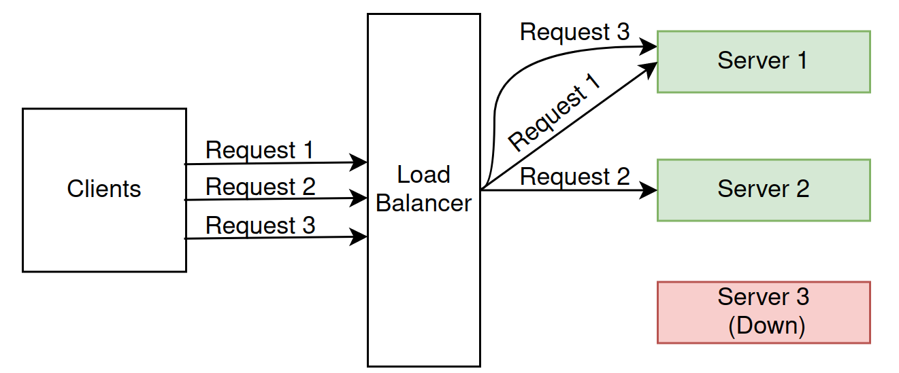
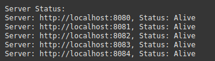

# Load Balancer

A round-robin load balancer with concurrent servers and live health checks.

## Quickstart

To start the application:
`go run main.go`

## Description

This load balancer uses the round-robin algorithm to evenly distribute incoming server requests.

Requests are cyclically assigned to the servers that are healthy.

The servers are designed to handle multiple requests concurrently.

Additionally, the system has live health checks, which periodically assessing the status of each server. Unhealthy servers are temporarily taken out of rotation, guaranteeing that only healthy servers are able to serve requests.

Here is a screenshot of the health check page with 5 healthy servers:

